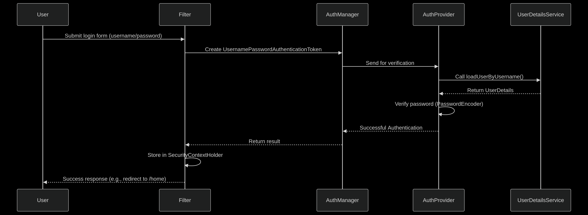

# Have you ever wondered what path the user should take when he sends a request to the server to reach the server and which way it returns to the user himself?

We are going to talk about these questions for a while and learn some things.
Spring Boot (and Spring Security) programs typically run on Java Servlet Containers such as Tomcat, Jetty, or Undertow. These servers are responsible for receiving HTTP requests and redirecting them to the program's filters and servers.

In the first step, when a user sends a request, things called filters come into play to process the requests and responses before they reach the server. 
Those filters that I mentioned are connected like chains and do basic and different functions.

Here are some of them with their full names:

<u> User Credential Check, Authentication: UsernamePasswordAutheticationFilter</u>

<u>Checking user access to resources (authorization): FilterSecurityInterceptor</u>  

<u> Attack Protection: |CsrfFilter</u> 

<u>Processor Tokens: wtAuthenticationFilter</u>

Our work is not finished with these names, we just introduced and said what filters are. 
 
**How do filters work? **
That's a good question, each HTTP request goes through a chain of filters before it reaches the program, and in the meantime, the filters can change the request, pass to the next filter, or block it at all!
In the future, we will talk about how they will do this, we are currently introducing the components, so don't rush at all. 

**After the filters are finished, your servant will come into play**

**But the question arises, what is this at all?**

Servlets are the final processing of requests and the production of responses. It seems to be very important. 

DispatcherServlet: Servlets in Java EE (and Spring MVC) are responsible for the final processing of requests and generating responses.

**What exactly is the role of servants?**

They send the request to the appropriate controller, execute the logic of the program, and finally generate the response. 

I repeat the point I said again, the filters are placed before and after the servant!

The difference between a filter and a servolet

|   Servlet | Filter |   Feature |
|-----------------------------------------------|----------------------------------------------------------------------|------------------------------------------|
|           Main Application Processing |       Pre-Servlet (Pre-Processing) |    Execution Position |
|               Performs the final processing |                          Can change or block |          Change Request/Response |
|                It is usually not used directly|                                                All Security Mechanisms |                Use in Spring Security|

The reason why we haven't done anything practically yet, is to first get a proper understanding and then go to writing it. 
Filtering is important.
The next point is that the servers are located on the server and are not a separate thing.

This is also a general path that we are going to go to one by one. 
