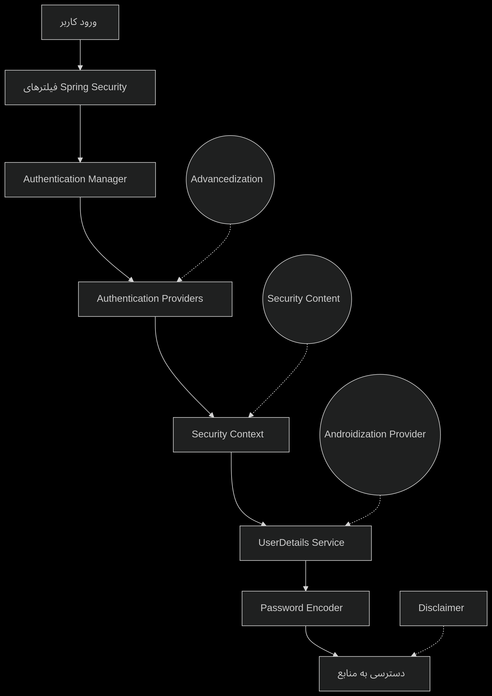

# جریان احراز هویت در Spring Security

1. **درخواست کاربر**  
   کاربر درخواستی به یک API یا نقطه پایانی MVC از طریق:
   - مرورگر وب
   - دستگاه موبایل
   - ابزارهایی مانند Postman
   ارسال می‌کند.

2. **فیلترهای Spring Security**  
   درخواست از میان زنجیره‌ای از ۲۰+ فیلتر امنیتی عبور می‌کند که:
   - محافظت در برابر CSRF
   - بررسی‌های CORS
   - مدیریت نشست (Session)
   - پردازش احراز هویت
   را انجام می‌دهند.

3. **ایجاد شیء Authentication**  
   `UsernamePasswordAuthenticationFilter` درخواست `HttpServletRequest` را به یک شیء `Authentication` تبدیل می‌کند که شامل:
   - اعتبارنامه‌ها (نام کاربری/رمز عبور)
   - اختیارات (نقش‌ها/مجوزها)
   می‌باشد.

4. **مدیریت احراز هویت (Authentication Manager)**  
   `AuthenticationManager` فرآیند احراز هویت را با:
   - واگذاری به `AuthenticationProvider`های پیکربندی شده
   - بازگرداندن یک شیء `Authentication` کاملاً پر شده
   هماهنگ می‌کند.

5. **تأمین‌کننده احراز هویت (Authentication Provider)**  
   `DaoAuthenticationProvider` عملیات واقعی احراز هویت را با:
   - بارگذاری جزئیات کاربر از طریق `UserDetailsService` (از حافظه/پایگاه داده)
   - مقایسه رمزهای عبور با استفاده از `PasswordEncoder`
   - بررسی وضعیت حساب (فعال/قفل شده/منقضی شده)
   انجام می‌دهد.

6. **نتیجه احراز هویت**  
   - در صورت موفقیت:
     - `isAuthenticated=true` تنظیم می‌شود
     - اختیارات اعطا شده پر می‌شوند
   - در صورت شکست:
     - `AuthenticationException` پرتاب می‌شود
     - کدهای `401 Unauthorized` یا `403 Forbidden` بازگردانده می‌شوند

7. **ذخیره در Security Context**  
   کاربر احراز هویت شده در:
   java
   SecurityContextHolder.getContext().setAuthentication(authentication);

