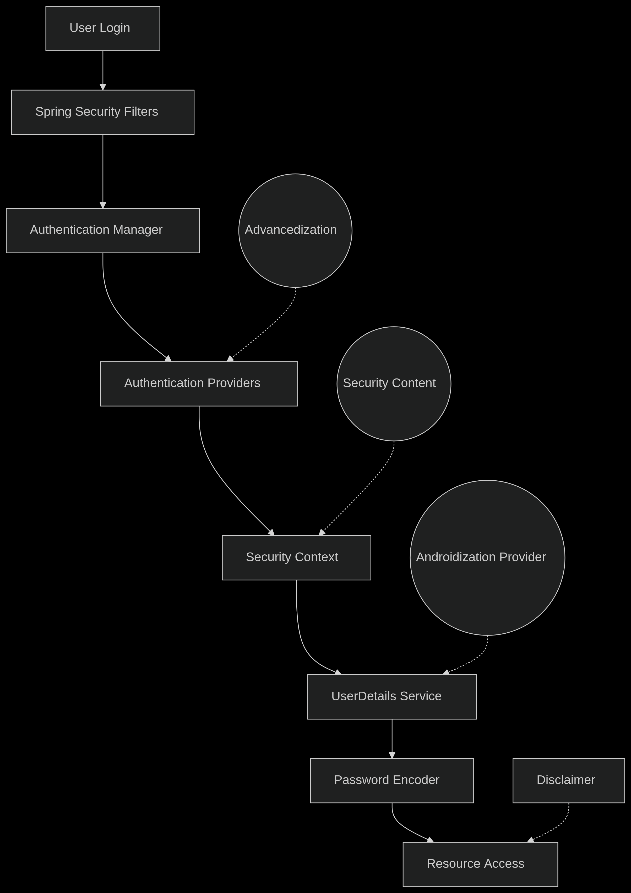

# Spring Security Authentication Flow

1. **User Request**  
   A user sends a request to an API or MVC endpoint from:
    - Web browser
    - Mobile device
    - Tools like Postman

2. **Spring Security Filters**  
   The request passes through a chain of 20+ security filters that perform:
    - CSRF protection
    - CORS checks
    - Session management
    - Authentication processing

3. **Create Authentication Object**  
   `UsernamePasswordAuthenticationFilter` converts the `HttpServletRequest` into an    `Authentication` object containing:
    - Credentials (username/password)
    - Authorities (roles/permissions)

4. **Authentication Manager**  
    - The `AuthenticationManager` orchestrates the authentication process by:
    - Delegating to configured `AuthenticationProvider`s
    - Returning a fully populated `Authentication` object

5. **Authentication Provider**  
    - The `DaoAuthenticationProvider` performs actual authentication by:
    - Loading user details via `UserDetailsService` (from memory/database)
    - Comparing passwords using `PasswordEncoder`
    - Verifying account status (enabled/locked/expired)

6. **Authentication Result**  
   - If successful:  
     - Sets `isAuthenticated=true`  
     - Populates granted authorities  
   - If failed:  
     - Throws `AuthenticationException`  
     - Returns `401 Unauthorized` or `403 Forbidden`

7. **Security Context Storage**  
   The authenticated user is stored in:
   java
   SecurityContextHolder.getContext().setAuthentication(authentication);

